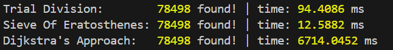
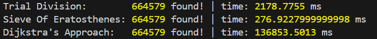

# Prime Numbers

I tested three different algorithms to find prime number between 1 - n.

1. [Trial Division](trial_division.ts)
2. [Sieve of Eratosthenes](sieve_of_eratosthenes.ts)
3. [Dijkstra's Approach](dijkstra.ts)

### Results
> Note: Tested in Bun v1.1.13 runtime.

#### 1 Million

#### 10 Million

### Conclusion
The results are surprising because Dijkstra's Approach is expected to be faster than Trial Division but slower than Sieve of Eratosthenes. My theory is that since JavaScript does not have a native heap implementation, this makes Dijkstra's Approach slower.

Please feel free to open Issues or PRs if you find any problems or you can improve the implementation.

### References
1. [Trial Division](https://en.wikipedia.org/wiki/Trial_division) (Wikipedia page)
2. [Sieve of Eratosthenes](https://en.wikipedia.org/wiki/Sieve_of_Eratosthenes) (Wikipedia page)
3. [Dijkstra's Prime Algorithm](https://wiki.tcl-lang.org/page/Dijkstra%27s+Prime+Algorithm) (Webpage)
4. [Dijkstra's Hidden Prime Finding Algorithm](https://www.youtube.com/watch?v=fwxjMKBMR7s&ab_channel=b001) (YouTube Video)
